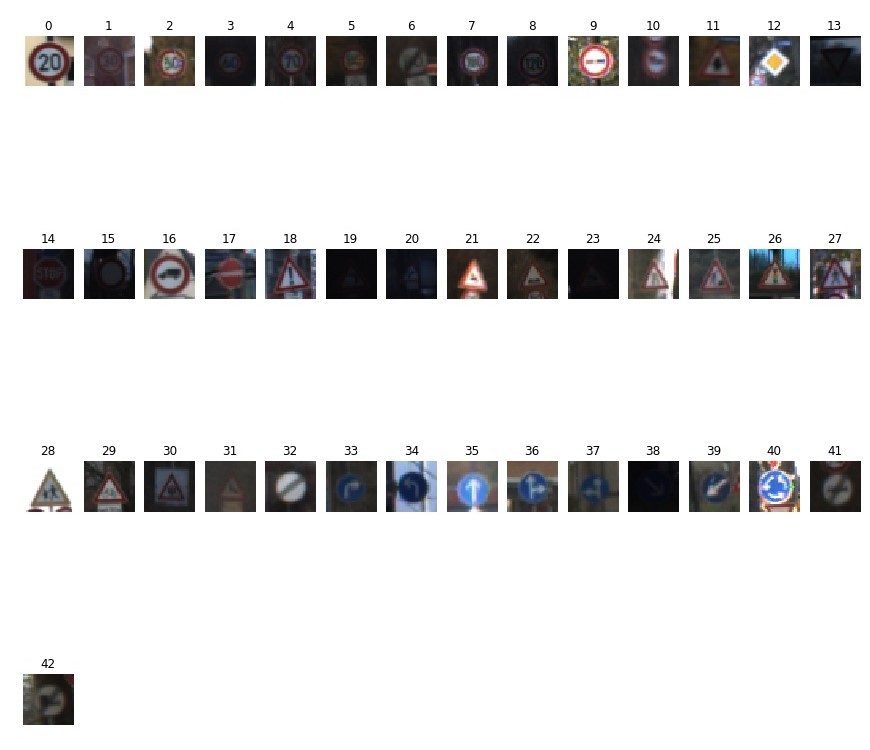
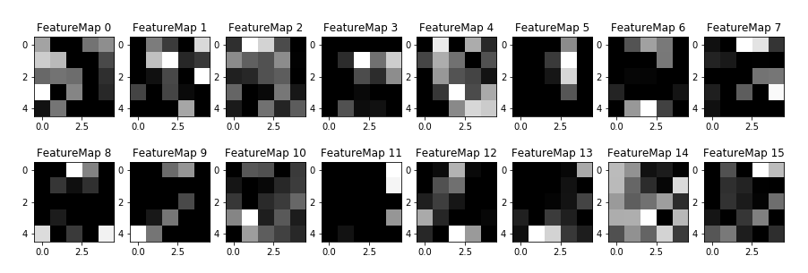

# CarND_TrafficSignClassifier
## _Traffic Sign Classifier :: Udacity - Self-Driving Car Engineer Nanodegree_

[](https://beta.mybinder.org/v2/gh/bitsurgeon/CarND_TrafficSignClassifier/master)
[](http://www.udacity.com/drive)  

### The goals / steps of this project are the following:
* Load the data set
* Explore, summarize and visualize the data set
* Design, train and test a model architecture
* Use the model to make predictions on new images
* Analyze the softmax probabilities of the new images
* Summarize the results with a written report

#### _Binder_
_Binder serves interactive notebooks online, so you can run the code and change the code within your browser without downloading the repository or installing Jupyter. Test drive online now by click the binder badge above._

---

### Dataset Exploration

1. [German Traffic Sign Datasets](http://benchmark.ini.rub.de/?section=gtsrb&subsection=dataset) is used to train and test the nerual network. There are 34799 sample images in the training set, and 12630 images in the testing set, which covers a total of 43 different German traffic signs. For each of the example image, the dimension is 32x32x3.

2. An example image of each of the 43 traffic signs are displayed in below for visual inspection.  
   

3. A data distribution has been checked for the training set in below. This provides how the different traffic signs are covered.  
     
   As illustrated, some traffic signs, such as Class 0, 19, 37, are having relatively smaller example image for model training. This may affect the recall rate for the model in testing.

### Design and Test a Model Architecture

1. A couple of different data preprocessing steps are applied.
   - grayscale image: traffic signs usually preserve the meaning if displayed in black and write color
   - pixel normalization: adjust the input data to zero mean can improve training performance and speedup training time
   - shuffle inputs: sometimes, the input sequence of the training data can affect the model performance. this is to eliminate this effect

2. The network model is based on  [LeNet-5](http://yann.lecun.com/exdb/lenet/) CNN with some modifications.  
     
   - the output predictions have 43 classes
   - dropout has been applied to the output of the two fully connected layers
   - first two convolutional layer outputs are extracted for visual inspection

3. The LeNet-5 used has 5 layers including the output layer. The first two layers are convolutional layers, and ReLu function is used as the activation function. Max pooling also applied to the layer outputs to improve model performance. The third and fourth layers are fully connected layers, and dropout has been applied to the output to reduce the model over fitting on the training data.

4. The model was training with learning rate set to 0.001, and batch size to 128, and epochs 30. Also, dropout rate are set to 0.5 for training and 1.0 for validation and testing.

5. During the model training, various learning rate were first explored, and then different batch sizes were checked. Epochs was then increased to reuse the training set to fine tune the model. Upon checking the training accuracy and the validation accuracy, there was about 0.08 to 0.1 difference, which indicate a model over fitting. Then, dropout rate was introduced to reduce this issue. After checking various dropout rate, 0.5 was selected, this can make the difference between training and validation accuracy down to around 0.03.

6. The final model achieved high accuracy on the validation and testing datasets as in below.
   ```log
   Training Accuracy = 0.997
   Validation Accuracy = 0.967
   Test Accuracy = 0.949
   ```

### Test a Model on New Images

1. Extra ten German traffic sign images were found from the internet, and all displayed for inspection.  
     

2. The trained model perform well on the new set of the test data, achieved 0.7 accuracy rate. When more preprocessing steps are used, the model will be out perform than current benchmark.

3. A very interesting part for accuracy analysis is to look at how the CNN model think about the input image and how much confidence it has on the predictions.
   ```log
    Sign	Prediction	Top 5 Predictions	Top 5 probabilities
    2	1		[1 5 6 0 2]     	[0.992 0.005 0.001 0.001 0.001]
    32	32		[32  6 36 41 42]     	[0.999 0.    0.    0.    0.   ]
    11	11		[11 30 21 27 40]     	[1. 0. 0. 0. 0.]
    4	4		[ 4  0  1 18 37]     	[1. 0. 0. 0. 0.]
    14	14		[14 34 15 38 22]     	[1. 0. 0. 0. 0.]
    0	1		[ 1  0 40  7  4]     	[0.94  0.048 0.005 0.003 0.001]
    40	40		[40 12 16  9 11]     	[0.964 0.022 0.006 0.003 0.002]
    28	28		[28 30 23 34 20]     	[1. 0. 0. 0. 0.]
    40	1		[ 1 12  6 32 11]     	[0.582 0.296 0.107 0.009 0.006]
    24	24		[24 26 22 29 18]     	[0.891 0.085 0.022 0.001 0.001]
   ```
   The model takes Sign ID 2 as ID 1 with very high confidence; while when miss classifying Sign ID 40 as ID 1 with low confidence.

### Visualize the Neural Network

1. In this step, the CNN black box was opened for visualization. The first two layers of the feature maps have been shown to see how the model selected the interesting part of the traffic sign by itself.  
     
   
